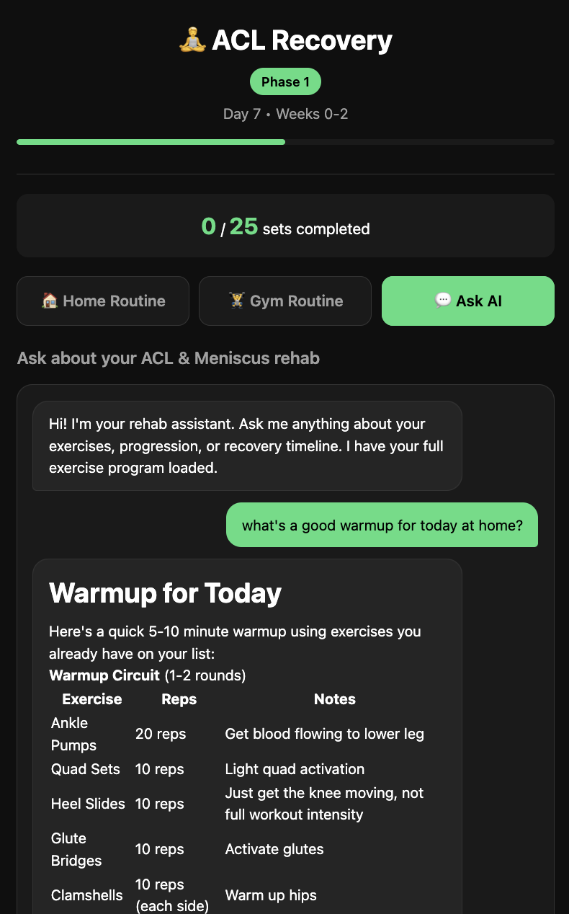
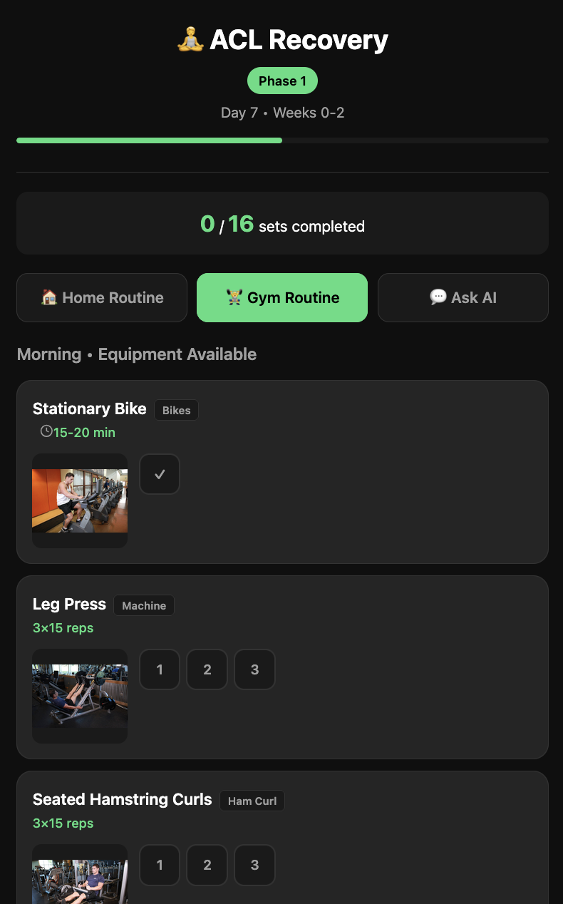

# physio

An AI-built ACL & meniscus recovery tracker, built entirely with AI assistance as a learning project.

## Screenshots

<p float="left">
  
  
  
</p>

## What This Is

A webapp for tracking daily ACL/meniscus rehabilitation exercises with:
- Phase-based exercise progression (5 phases, 0-24+ weeks)
- Home (yoga mat + bands) and Gym routines
- Set-by-set progress tracking with localStorage persistence
- AI chat assistant for rehab questions (powered by OpenCode Go / MiniMax M2.5)

## Tech Stack

- **Frontend:** Vanilla HTML/CSS/JS (dark theme, mobile-first)
- **Backend:** Node.js (simple proxy for AI API)
- **AI:** OpenCode Go (MiniMax M2.5) via proxy
- **Deployment:** Docker, Dockge

## The AI Journey

This project is a learning experiment — I prompted an AI to build this from scratch, iterating on requirements. Every file was generated or modified by AI based on my prompts. It's not production-quality, but it works and demonstrates what's possible with AI-assisted coding.

Key lessons:
- AI can scaffold complete apps quickly
- Iteration requires clear, specific feedback
- AI makes weird architectural choices sometimes
- The human role becomes requirement clarification and quality control

## Disclaimer

⚠️ **Not medical advice.** This is a personal project. Follow your PT's instructions.

## Setup

```bash
# Development
./scripts/deploy_nas.sh   # Deploy to NAS
# Then start with docker compose or Dockge

# Local development (no Docker)
node server.js
```

## Key Files

- `server.js` - Node.js server with OpenCode API proxy
- `public/index.html` - Main webapp
- `public/exercises.json` - Exercise program (easily editable)
- `scripts/deploy_nas.sh` - One-command deployment to NAS

## License

MIT
